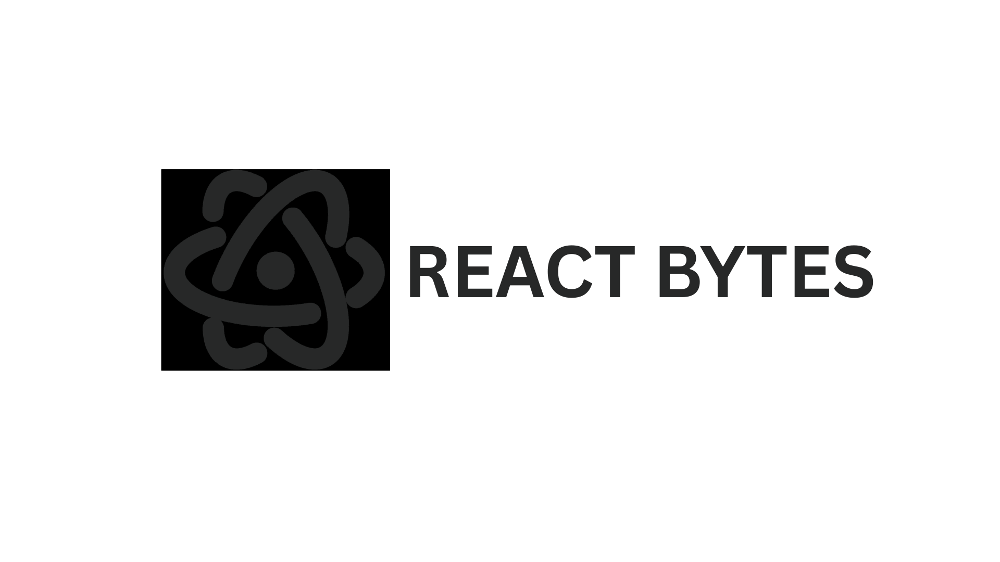
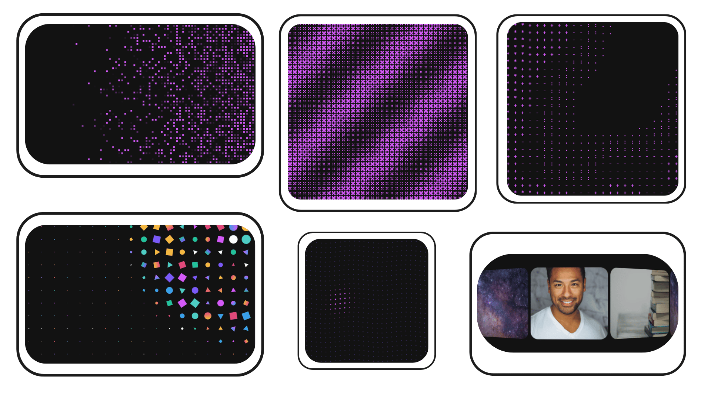

<div align="center">
  <br>
  <picture>
        <source media="(prefers-color-scheme: light)" srcset="src/assets/logos/reactbytes-gh-black.svg">
        <source media="(prefers-color-scheme: dark)" srcset="src/assets/logos/reactbytes-gh-white.svg">
        
  </picture>
	<br>
	<br>
  <strong>Free, open-source, animated React components for building memorable UIs.**</strong>
	<br>
  <sub>Stand out with 20+ free, customizable animations for text, backgrounds, and UI.</sub>
  <br />
  <br>
  <a href="https://github.com/tasin-hossain/react-bytes/stargazers"></a>
  <a href="https://github.com/tasin-hossain/react-bytes/blob/main/LICENSE.md"></a>
  <br>
  <br>
  <a href="https://reactbytes.online/">📖 Introduction</a>  <a href="https://reactbytes.online/get-started/installation">⚡ Installation Start</a>  <a href="https://reactbytes.online/get-started/all-components">👀 All Components</a> <a href="https://reactbytes.online/get-started/mcp">🤖 MCP</a>
</div>

<br />

<div align="center">
  
</div>

## About

React Bytes is an open-source showcase of creative React components crafted for developers who want their products to stand out. Instead of another collection of basic UI elements, React Bytes delivers unique interactions, eye-catching effects, and modern design patterns — Text Animations, Components, and Backgrounds — ready to drop into any React project.

- **Open & Free** — free to use, modify, and ship in any project, personal or commercial.
- **Customization First** — flexible props and options make every component easy to tailor.
- **Modular by Design** — install only what you need and keep your bundle lightweight.
- **Developer Freedom** — every component ships in 4 variants: `JS-CSS`, `JS-TW`, `TS-CSS`, `TS-TW`.

## Installation

### Manual

Install the shared dependencies, then copy the component source straight from the site into your project:

```bash
npm install framer-motion gsap
```

```jsx
import MagneticText from './components/MagneticText';

export default function App() {
  return <MagneticText text="ATTRACT" />;
}
```

### CLI (shadcn / jsrepo)

Pull any component directly into your project with a one-time command:

```bash
# shadcn
npx shadcn@latest add https://reactbytes.online/r/<Component>-<LANG>-<STYLE>

# jsrepo
npx jsrepo@latest add shadcn:https://reactbytes.online/r/<Component>-<LANG>-<STYLE>
```

Where `<LANG>` is `JS` or `TS`, and `<STYLE>` is `CSS` or `TW`. Example:

```bash
npx shadcn@latest add https://reactbytes.online/r/MagneticText-JS-CSS
```

### MCP (AI editors)

React Bytes also ships an MCP-compatible registry so AI editors (Claude Code, Cursor, VS Code) can browse and install components on demand. See [reactbytes.online/get-started/mcp](https://reactbytes.online/get-started/mcp) for setup steps.

## Components

| Category            | Components                                                                                                 |
| ------------------- | ---------------------------------------------------------------------------------------------------------- |
| **Text Animations** | Magnetic Text, Curtain Text, Cursor Trail, Blur Text, MeltGlitch Text                                      |
| **Components**      | Rotating Cards, Rotating Carousel                                                                          |
| **Backgrounds**     | MouseRepel Dots, MouseRepel Grid, Blinking Squares, Half Tone, Vortex, Ascii Wave, Emoji Wave, Shapes Dots |

Browse the full, searchable list at [All Components](https://reactbytes.online/get-started/all-components).

## Tools

- **Shape Magic** — build smooth merged blob shapes with auto inner-rounded corners, gradients, shadows, outlines, and presets. Export as SVG, PNG, JPG, React, or CSS `clip-path`.

## Tech Stack

- [React 19](https://react.dev) + [Vite](https://vitejs.dev)
- [Tailwind CSS v4](https://tailwindcss.com)
- [GSAP](https://gsap.com) & [Motion](https://motion.dev) for animation
- [Three.js](https://threejs.org) / [React Three Fiber](https://docs.pmnd.rs/react-three-fiber) & [OGL](https://github.com/oframe/ogl) for WebGL backgrounds
- [jsrepo](https://jsrepo.dev) / [shadcn](https://ui.shadcn.com) for the component registry & CLI

## Development

```bash
# install dependencies
npm install

# start the dev server (registry + docs, hot-reloading)
npm run start

# or just the docs site
npm run dev

# build for production (registry build + sitemap + vite build)
npm run build

# lint
npm run lint

# format
npm run format
```

## Project Structure

```
src/
├── components/       # Site UI (navbars, layout, shared, ui, code, context)
├── content/          # Live demo content per component
├── demo/             # Demo pages
├── docs/             # Get Started docs (Introduction, Installation, MCP, All Components)
├── constants/        # Component metadata, categories, site config
├── variants/         # JS-CSS / JS-TW / TS-CSS / TS-TW component source
├── tools/            # Standalone tools (e.g. Shape Magic)
├── pages/            # Route pages
├── hooks/            # Shared hooks
└── scripts/          # Registry build & sitemap generation
```

## Contributing

This project is open source and contributions are welcome. If you've built something cool with React and want to share it, feel free to open a pull request.

## License

React Bytes is free to use, modify, and ship in personal or commercial projects.

## Links

- 🌐 [reactbytes.online](https://reactbytes.online)
- 💻 [GitHub Repository](https://github.com/Tasin-Hossain/React-Bytes)

---

<div align="center">Built by <a href="https://github.com/Tasin-Hossain">Mohammad Tasin</a></div>
